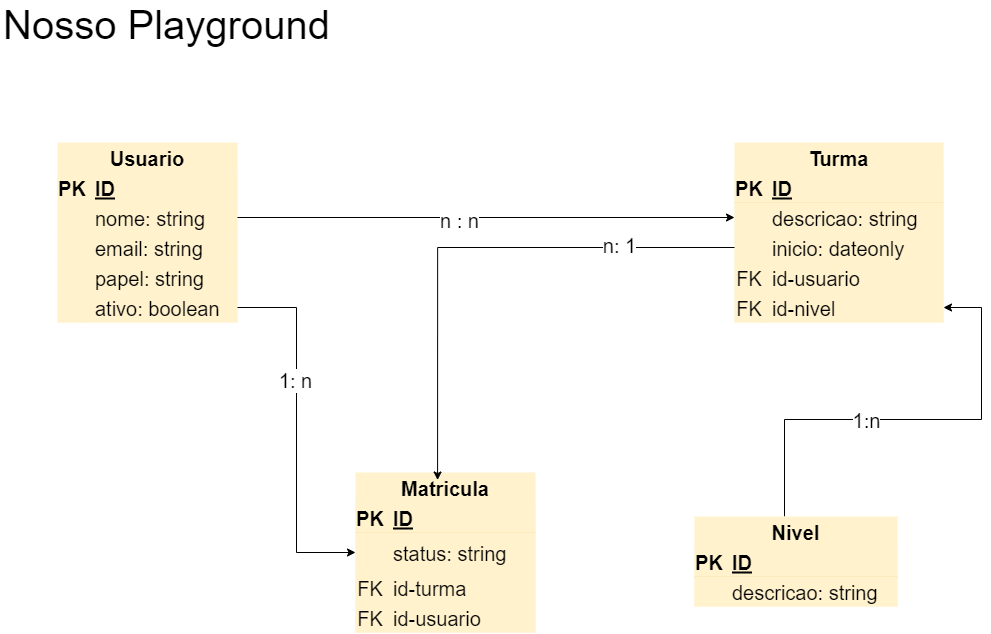

# Primeiros passos

- Ter um Sistema de Gerenciamento de Banco de Dados - SGBD (MySQL, PostgreSQL, MariaDB e outros) local ou com o Docker.
- Testar a conexão no Bekeeper ou outra aplicação de sua escolha. Usuar o usuário e senha e tentar se conectar.
- Criar o banco:
  ```jsx
  create database nome;
  ```

# Criando a modelagem banco



# Inicializar o projeto

- Criar um projeto usando o express-generator:
  ```jsx
  npx express-generator --view=ejs nomeProjeto
  ```
- Instalar as dependências:
  ```jsx
  npm install
  ```
- Instalar os pacotes necessários para usar o Sequelize:
  ```jsx
  npm install mysql2 sequelize sequelize-cli path body-parser
  ```
- Inicializar o Sequelize no projeto:
  ```jsx
  npx sequelize-cli init
  ```
- Criar uma pasta database e mover tudo o que o Sequelize gerou para essa pasta.
- Criar o arquivo .sequelirerc na pasta raiz com o seguinte conteúdo:

  ```jsx
  const path = require('path');

  module.exports = {
    config: path.resolve('config', 'database.json'),
    'models-path': path.resolve('db', 'models'),
    'seeders-path': path.resolve('db', 'seeders'),
    'migrations-path': path.resolve('db', 'migrations'),
  };
  ```

- Se houve mudança do local dos repositórios é nesse arquivo onde iremos adicionar os novos caminhos.

# Criando as models

```jsx
npx sequelize-cli model:generate --name Usuario --attributes nome:string,email:string,papel:string,ativo:boolean

npx sequelize-cli model:generate --name Nivel --attributes descricao:string

npx sequelize-cli model:generate --name Matricula --attributes status:string

npx sequelize-cli model:generate --name Turma --attributes descricao:string,inicio:dateonly
```

# Atualizando o banco com as models criadas

```jsx
npx sequelize-cli db:migrate
```
